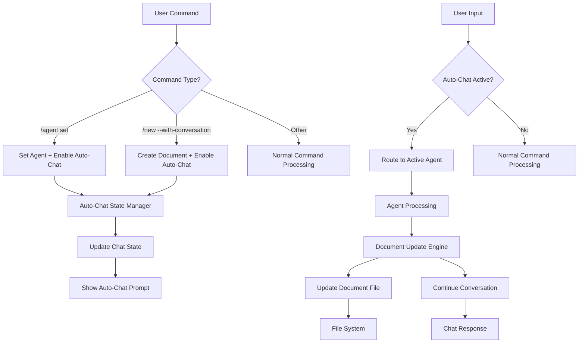

# Design Document

## Overview

This design addresses two critical workflow issues in the Docu extension: the lack of automatic chat mode transition after agent/document commands, and the missing document file updates during conversations. The solution introduces an Auto-Chat State Manager that tracks when users should be able to chat directly, and a Document Update Engine that writes conversation content back to files in real-time.

## Architecture

### Current Problem Analysis

The current system has several architectural gaps:

1. **Missing Auto-Chat State Management**: After `/agent set` or `/new --with-conversation`, users must manually type `/chat` to continue
2. **No Document Update Integration**: Conversations happen in chat but don't update the actual document files
3. **Disconnected Conversation Flow**: The conversation system and file system operate independently
4. **Poor State Persistence**: No tracking of when auto-chat mode should be active

### Proposed Solution Architecture



## Components and Interfaces

### 1. AutoChatStateManager

Manages when users can chat directly without `/chat` command:

```typescript
interface AutoChatStateManager {
    /**
     * Enable auto-chat mode for current session
     */
    enableAutoChat(
        agentName: string,
        documentPath?: string,
        context?: AutoChatContext
    ): void;

    /**
     * Disable auto-chat mode
     */
    disableAutoChat(): void;

    /**
     * Check if auto-chat is currently active
     */
    isAutoChatActive(): boolean;

    /**
     * Get current auto-chat context
     */
    getAutoChatContext(): AutoChatContext | null;

    /**
     * Show auto-chat prompt to user
     */
    showAutoChatPrompt(stream: vscode.ChatResponseStream): void;
}

interface AutoChatContext {
    agentName: string;
    documentPath?: string;
    templateId?: string;
    conversationSessionId?: string;
    enabledAt: Date;
    lastActivity: Date;
}
```

### 2. DocumentUpdateEngine

Handles writing conversation content back to document files:

```typescript
interface DocumentUpdateEngine {
    /**
     * Update document based on conversation response
     */
    updateDocumentFromConversation(
        documentPath: string,
        conversationResponse: ConversationResponse,
        templateStructure: TemplateStructure
    ): Promise<DocumentUpdateResult>;

    /**
     * Map conversation content to document sections
     */
    mapContentToSections(
        content: string,
        templateStructure: TemplateStructure,
        conversationContext: ConversationContext
    ): SectionUpdateMap;

    /**
     * Apply section updates to document
     */
    applySectionUpdates(
        documentPath: string,
        updates: SectionUpdateMap
    ): Promise<void>;

    /**
     * Track document update progress
     */
    getUpdateProgress(documentPath: string): DocumentUpdateProgress;
}

interface DocumentUpdateResult {
    success: boolean;
    sectionsUpdated: string[];
    error?: string;
    progressPercentage: number;
}

interface SectionUpdateMap {
    [sectionName: string]: {
        content: string;
        mode: 'replace' | 'append' | 'prepend';
        priority: number;
    };
}
```

### 3. Enhanced Command Handlers

Modify existing command handlers to enable auto-chat:

```typescript
interface EnhancedAgentCommandHandler {
    /**
     * Handle agent set command with auto-chat enablement
     */
    handleAgentSet(
        agentName: string,
        context: CommandContext,
        autoChatManager: AutoChatStateManager
    ): Promise<CommandResult>;
}

interface EnhancedNewCommandHandler {
    /**
     * Handle new document command with conversation integration
     */
    handleNewWithConversation(
        title: string,
        options: NewCommandOptions,
        context: CommandContext,
        autoChatManager: AutoChatStateManager,
        documentUpdateEngine: DocumentUpdateEngine
    ): Promise<CommandResult>;
}
```

### 4. Enhanced Conversation Session Router

Extend the existing router to handle auto-chat state:

```typescript
interface EnhancedConversationSessionRouter extends ConversationSessionRouter {
    /**
     * Route user input with auto-chat awareness
     */
    routeUserInputWithAutoChat(
        input: string,
        context: CommandContext,
        autoChatState: AutoChatContext | null
    ): Promise<ConversationRoutingResult>;

    /**
     * Handle document updates during conversation
     */
    handleConversationWithDocumentUpdates(
        sessionId: string,
        input: string,
        context: CommandContext,
        documentUpdateEngine: DocumentUpdateEngine
    ): Promise<ConversationRoutingResult>;
}
```

## Data Models

### AutoChatState

Track auto-chat session state:

```typescript
interface AutoChatState {
    isActive: boolean;
    context: AutoChatContext | null;
    sessionStartTime: Date | null;
    lastUserInput: Date | null;
    messageCount: number;
}
```

### DocumentUpdateProgress

Track document building progress:

```typescript
interface DocumentUpdateProgress {
    documentPath: string;
    templateId: string;
    totalSections: number;
    completedSections: number;
    progressPercentage: number;
    lastUpdated: Date;
    updateHistory: DocumentUpdate[];
}

interface DocumentUpdate {
    timestamp: Date;
    sectionName: string;
    contentAdded: string;
    updateType: 'initial' | 'append' | 'replace';
    conversationTurn: number;
}
```

### ConversationDocumentMapping

Map conversation responses to document structure:

```typescript
interface ConversationDocumentMapping {
    templateId: string;
    sectionMappings: {
        [conversationTopic: string]: {
            targetSection: string;
            contentTransform?: (input: string) => string;
            priority: number;
        };
    };
    placeholderMappings: {
        [placeholder: string]: {
            conversationKey: string;
            defaultValue?: string;
        };
    };
}
```

## Error Handling

### Auto-Chat State Errors

1. **State Persistence Failure**: When auto-chat state can't be saved/loaded
2. **Agent Unavailable**: When auto-chat is enabled but agent becomes unavailable
3. **Session Timeout**: When auto-chat session expires
4. **Concurrent Sessions**: When multiple auto-chat sessions conflict

### Document Update Errors

1. **File Access Errors**: When document file can't be read/written
2. **Template Structure Mismatch**: When conversation content doesn't match template
3. **Content Mapping Failures**: When conversation responses can't be mapped to sections
4. **Concurrent Edit Conflicts**: When user edits file while conversation updates it

### Recovery Mechanisms

```typescript
interface AutoChatErrorRecovery {
    /**
     * Handle auto-chat state corruption
     */
    recoverAutoChatState(): Promise<void>;

    /**
     * Handle document update failures
     */
    recoverDocumentUpdate(
        documentPath: string,
        failedUpdate: DocumentUpdate,
        error: Error
    ): Promise<DocumentUpdateResult>;

    /**
     * Provide fallback when auto-chat fails
     */
    provideFallbackGuidance(
        error: AutoChatError,
        context: CommandContext
    ): Promise<void>;
}
```

## Testing Strategy

### Unit Tests

1. **AutoChatStateManager Tests**
   - Test state enablement/disablement
   - Test state persistence and recovery
   - Test timeout and cleanup logic

2. **DocumentUpdateEngine Tests**
   - Test content mapping to sections
   - Test file update operations
   - Test progress tracking

3. **Enhanced Command Handler Tests**
   - Test auto-chat enablement after commands
   - Test integration with existing command flow
   - Test error handling scenarios

### Integration Tests

1. **End-to-End Auto-Chat Flow Tests**
   - Test `/agent set` → auto-chat → conversation flow
   - Test `/new --with-conversation` → document creation → conversation → file updates
   - Test conversation completion and state cleanup

2. **Document Update Integration Tests**
   - Test conversation responses updating document files
   - Test multiple conversation turns building document progressively
   - Test template structure preservation during updates

### Performance Tests

1. **Auto-Chat State Performance**
   - Measure state transition times
   - Test memory usage with multiple sessions
   - Test state persistence overhead

2. **Document Update Performance**
   - Measure file update latency
   - Test large document update performance
   - Test concurrent update handling

## Implementation Plan

### Phase 1: Auto-Chat State Management

1. Create AutoChatStateManager component
2. Integrate with existing command handlers
3. Update ConversationSessionRouter to check auto-chat state
4. Implement state persistence and recovery

### Phase 2: Document Update Engine

1. Create DocumentUpdateEngine component
2. Implement content-to-section mapping logic
3. Integrate with conversation system
4. Add progress tracking and update history

### Phase 3: Enhanced Command Integration

1. Update `/agent set` command to enable auto-chat
2. Update `/new` command to support conversation integration
3. Enhance conversation flow to include document updates
4. Add user feedback and progress indicators

### Phase 4: Error Handling and Polish

1. Implement comprehensive error recovery
2. Add performance optimizations
3. Enhance user experience with better prompts
4. Add telemetry and debugging support

## User Experience Improvements

### Auto-Chat Prompts

Examples of improved user feedback:

```markdown
✅ **Agent Set: PRD Creator**

🤖 **Ready for conversation!** You can now chat directly without using `/chat`.

💡 **What would you like to work on?**
- Tell me about your product idea
- Help me define user requirements  
- Review my existing PRD draft

💬 **Just type your message below to get started!**
```

### Document Update Feedback

```markdown
🚀 **PRD Creator Conversation Started**

📝 **Document:** docs/01-prd/CardCraft-PRD.md

**Question 1:** What problem does CardCraft solve for card game enthusiasts?

💡 **Your response will be automatically added to the "Problem Statement" section**

📊 **Progress:** 0% complete (0/8 sections filled)
```

### Conversation with Live Updates

```markdown
**Great response!** ✅

📝 **Document Updated:** Added problem statement to PRD
📍 **Section:** Problem Statement  
📊 **Progress:** 12% complete (1/8 sections filled)

**Next Question:** Who are your primary target users?

💡 **This will help build the "Target Users" section**
```

## Success Metrics

### Auto-Chat Adoption

- Percentage of users who continue conversations after `/agent set`
- Average conversation length after auto-chat enablement
- User satisfaction with seamless chat transition

### Document Update Effectiveness

- Percentage of conversations that result in document updates
- Average document completion rate through conversations
- User satisfaction with automated document building

### Workflow Efficiency

- Reduction in manual `/chat` command usage
- Time saved in document creation workflows
- Improved user retention and feature adoption

## Migration Strategy

### Backward Compatibility

- Maintain existing `/chat` command functionality
- Ensure existing conversation flows continue to work
- Provide opt-out mechanism for auto-chat behavior

### Gradual Rollout

1. Implement auto-chat state management alongside existing system
2. Add document update engine as optional feature
3. Enable auto-chat by default for new users
4. Migrate existing users with clear communication

### Risk Mitigation

- Feature flags for auto-chat and document updates
- Comprehensive logging for debugging workflow issues
- Fallback to manual chat mode when auto-chat fails
- User feedback collection during migration period