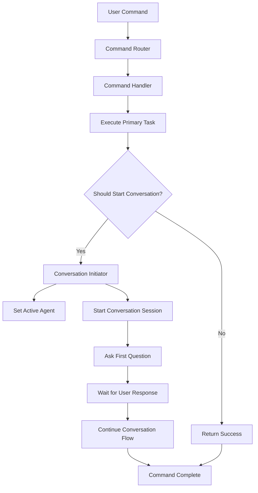

# Design Document

## Overview

The command conversation flow fix addresses the critical issue where commands like `/new` fail to properly continue conversations after document creation. The current implementation starts conversations but doesn't maintain the conversation state properly, causing the flow to break. This design establishes a unified conversation continuation mechanism that works across all commands and maintains proper state management.

## Architecture

### Current Problem Analysis

The current system has several architectural issues:

1. **Fragmented Conversation Initialization**: Commands start conversations but don't properly hand off control to the conversation manager
2. **Inconsistent State Management**: Conversation state is not properly maintained after command execution
3. **Broken Flow Continuation**: The conversation flow stops after the initial question is asked
4. **Duplicated Logic**: Multiple patterns exist for starting conversations, leading to inconsistency

### Proposed Solution Architecture



## Components and Interfaces

### 1. ConversationContinuationManager

A new component responsible for managing the transition from command execution to conversation flow.

```typescript
interface ConversationContinuationManager {
    /**
     * Initiate conversation after command execution
     */
    initiatePostCommandConversation(
        commandResult: CommandResult,
        conversationConfig: ConversationConfig,
        context: CommandContext
    ): Promise<ConversationInitiationResult>;

    /**
     * Check if a command should continue with conversation
     */
    shouldContinueWithConversation(
        commandName: string,
        flags: Record<string, any>,
        templateId?: string
    ): boolean;

    /**
     * Get conversation configuration for a command/template combination
     */
    getConversationConfig(
        commandName: string,
        templateId?: string
    ): ConversationConfig | null;
}
```

### 2. Enhanced CommandResult Interface

Extend the existing CommandResult to support conversation continuation:

```typescript
interface EnhancedCommandResult extends CommandResult {
    conversationConfig?: ConversationConfig;
    shouldContinueConversation?: boolean;
    agentName?: string;
    documentPath?: string;
}
```

### 3. ConversationConfig Interface

Define configuration for conversation initiation:

```typescript
interface ConversationConfig {
    agentName: string;
    templateId: string;
    documentPath: string;
    title: string;
    initialQuestions: Question[];
    conversationContext: ConversationContext;
}
```

### 4. Unified Conversation Flow Handler

Replace the current fragmented conversation starting logic with a single, unified handler:

```typescript
interface ConversationFlowHandler {
    /**
     * Start and continue conversation flow
     */
    startConversationFlow(
        config: ConversationConfig,
        context: CommandContext
    ): Promise<void>;

    /**
     * Continue existing conversation
     */
    continueConversation(
        sessionId: string,
        userResponse: string,
        context: CommandContext
    ): Promise<void>;
}
```

## Data Models

### ConversationState Enhancement

Extend the existing conversation state to track command-initiated conversations:

```typescript
interface EnhancedConversationState extends ConversationState {
    initiatedByCommand?: string;
    documentPath?: string;
    templateId?: string;
    commandContext?: Partial<CommandContext>;
}
```

### CommandConversationMapping

Define mappings between commands and their conversation configurations:

```typescript
interface CommandConversationMapping {
    commandName: string;
    templateMappings: {
        [templateId: string]: {
            agentName: string;
            autoStart: boolean;
            questions: Question[];
        };
    };
    defaultAgent?: string;
    conversationFlags: string[];
}
```

## Error Handling

### Conversation Initiation Failures

1. **AI Service Unavailable**: Fall back to offline conversation mode
2. **Agent Not Found**: Use default agent or show agent selection
3. **Template Configuration Missing**: Use basic conversation flow
4. **Conversation Manager Error**: Provide manual conversation restart options

### State Management Errors

1. **Session State Loss**: Implement session recovery mechanisms
2. **Context Corruption**: Reset conversation with user confirmation
3. **Agent Switching Failures**: Maintain previous agent state

### Recovery Mechanisms

```typescript
interface ConversationRecoveryManager {
    recoverFromFailure(
        error: ConversationError,
        context: CommandContext
    ): Promise<RecoveryResult>;
    
    provideFallbackOptions(
        failedConfig: ConversationConfig,
        context: CommandContext
    ): Promise<void>;
}
```

## Testing Strategy

### Unit Tests

1. **ConversationContinuationManager Tests**
   - Test conversation initiation logic
   - Test configuration resolution
   - Test error handling scenarios

2. **Command Handler Integration Tests**
   - Test each command's conversation continuation
   - Test flag-based conversation control
   - Test template-specific conversation flows

3. **Conversation Flow Tests**
   - Test seamless transition from command to conversation
   - Test conversation state persistence
   - Test agent switching during conversations

### Integration Tests

1. **End-to-End Command Flow Tests**
   - Test complete `/new` command with conversation
   - Test `/update` command conversation flow
   - Test `/review` command conversation flow

2. **Cross-Component Integration Tests**
   - Test CommandRouter → ConversationManager integration
   - Test AgentManager → ConversationManager coordination
   - Test OfflineManager → ConversationManager fallback

### Performance Tests

1. **Conversation Initiation Performance**
   - Measure time from command completion to first question
   - Test memory usage during conversation transitions
   - Test concurrent conversation handling

## Implementation Plan

### Phase 1: Core Infrastructure

1. Create ConversationContinuationManager
2. Enhance CommandResult interface
3. Implement ConversationFlowHandler
4. Update conversation state management

### Phase 2: Command Integration

1. Update `/new` command handler
2. Update `/update` command handler  
3. Update `/review` command handler
4. Update other conversation-capable commands

### Phase 3: Legacy Code Cleanup

1. Remove duplicated conversation initialization code
2. Consolidate conversation starting patterns
3. Remove unused conversation management functions
4. Update all conversation-related imports and dependencies

### Phase 4: Testing and Validation

1. Implement comprehensive test suite
2. Validate conversation flow continuity
3. Test offline mode compatibility
4. Performance optimization and validation

## Migration Strategy

### Backward Compatibility

- Maintain existing conversation APIs during transition
- Provide deprecation warnings for old patterns
- Ensure existing conversations continue to work

### Gradual Rollout

1. Implement new system alongside existing system
2. Migrate commands one by one to new pattern
3. Remove old system after all commands are migrated
4. Clean up legacy code and dependencies

### Risk Mitigation

- Feature flags for new conversation system
- Rollback capability to previous conversation handling
- Comprehensive logging for debugging transition issues
- User feedback collection during migration period