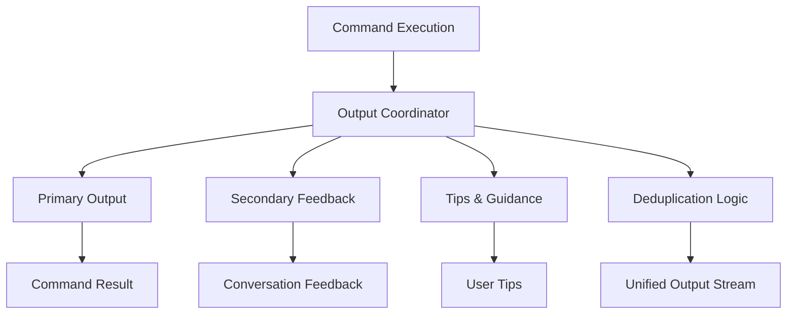
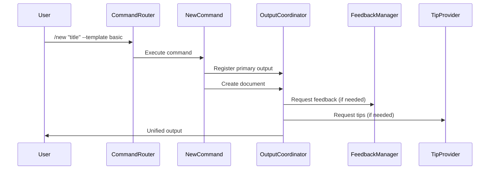

# Design Document

## Overview

The command output duplication issue stems from multiple feedback systems operating independently without coordination. The `/new` command currently returns placeholder messages, and various feedback managers (ConversationFeedbackManager, CommandTipProvider) can produce overlapping or duplicate output. This design addresses these issues by implementing a unified output coordination system and completing the `/new` command implementation.

## Architecture

### Output Coordination System



### Command Implementation Flow



## Components and Interfaces

### OutputCoordinator

```typescript
interface OutputCoordinator {
    registerPrimaryOutput(source: string, content: OutputContent): void;
    addSecondaryFeedback(source: string, content: FeedbackContent): void;
    addTips(source: string, tips: CommandTip[]): void;
    render(stream: vscode.ChatResponseStream): Promise<void>;
    clear(): void;
}

interface OutputContent {
    type: 'success' | 'error' | 'info';
    title: string;
    message: string;
    details?: string[];
    nextSteps?: string[];
}

interface FeedbackContent {
    type: 'conversation' | 'guidance' | 'warning';
    content: string;
    priority: number;
}
```

### Enhanced NewCommand Handler

```typescript
interface NewCommandHandler {
    execute(parsedCommand: ParsedCommand, context: CommandContext): Promise<CommandResult>;
    createDocument(title: string, templateId: string, outputPath?: string): Promise<DocumentCreationResult>;
    validateInputs(parsedCommand: ParsedCommand): ValidationResult;
    generateOutputPath(title: string, templateId: string, customPath?: string): string;
}

interface DocumentCreationResult {
    success: boolean;
    filePath?: string;
    templateUsed?: string;
    fileSize?: number;
    error?: string;
}
```

### Feedback Coordination

```typescript
interface FeedbackCoordinator {
    shouldShowConversationFeedback(commandResult: CommandResult): boolean;
    shouldShowTips(commandName: string, flags: Record<string, any>): boolean;
    coordinateFeedback(
        primaryOutput: OutputContent,
        conversationFeedback?: FeedbackContent,
        tips?: CommandTip[]
    ): CoordinatedOutput;
}

interface CoordinatedOutput {
    sections: OutputSection[];
    duplicatesRemoved: string[];
}
```

## Data Models

### Command Output State

```typescript
interface CommandOutputState {
    primaryOutput?: OutputContent;
    secondaryFeedback: Map<string, FeedbackContent>;
    tips: Map<string, CommandTip[]>;
    rendered: boolean;
    duplicatesSuppressed: string[];
}
```

### Template Integration

```typescript
interface TemplateService {
    getTemplate(templateId: string): Promise<Template>;
    renderTemplate(template: Template, variables: Record<string, any>): Promise<string>;
    getDefaultVariables(templateId: string): Record<string, any>;
}

interface Template {
    id: string;
    name: string;
    description: string;
    content: string;
    variables: TemplateVariable[];
    frontMatter: Record<string, any>;
}
```

## Error Handling

### Graceful Degradation Strategy

1. **Template Loading Failures**: Fall back to basic template with user notification
2. **File Creation Failures**: Provide clear error messages with recovery options
3. **Path Resolution Issues**: Suggest alternative paths and validate permissions
4. **Feedback System Failures**: Continue with primary output, log secondary failures

### Error Recovery Patterns

```typescript
interface ErrorRecoveryStrategy {
    canRecover(error: Error): boolean;
    recover(error: Error, context: CommandContext): Promise<RecoveryResult>;
    provideFallback(originalIntent: CommandIntent): Promise<FallbackResult>;
}
```

## Testing Strategy

### Unit Tests

1. **OutputCoordinator Tests**
   - Test deduplication logic
   - Test output ordering and priority
   - Test rendering with various content types

2. **NewCommand Tests**
   - Test document creation with different templates
   - Test path generation and validation
   - Test error handling scenarios

3. **FeedbackCoordinator Tests**
   - Test feedback coordination logic
   - Test duplicate detection and removal
   - Test priority-based ordering

### Integration Tests

1. **Command Flow Tests**
   - Test complete `/new` command execution
   - Test output coordination across multiple feedback sources
   - Test conversation integration without duplication

2. **Template Integration Tests**
   - Test template loading and rendering
   - Test variable substitution
   - Test front matter processing

### End-to-End Tests

1. **User Workflow Tests**
   - Test complete document creation workflow
   - Test conversation initiation from commands
   - Test error recovery scenarios

## Implementation Phases

### Phase 1: Output Coordination Infrastructure
- Implement OutputCoordinator class
- Create FeedbackCoordinator for managing multiple feedback sources
- Add deduplication logic and priority handling

### Phase 2: NewCommand Implementation
- Complete `/new` command handler implementation
- Integrate with template system
- Add proper file creation and path handling

### Phase 3: Feedback Integration
- Integrate OutputCoordinator with existing feedback systems
- Update ConversationFeedbackManager to use coordination
- Update CommandTipProvider to register with coordinator

### Phase 4: Testing and Refinement
- Implement comprehensive test suite
- Add error handling and recovery mechanisms
- Performance optimization and cleanup