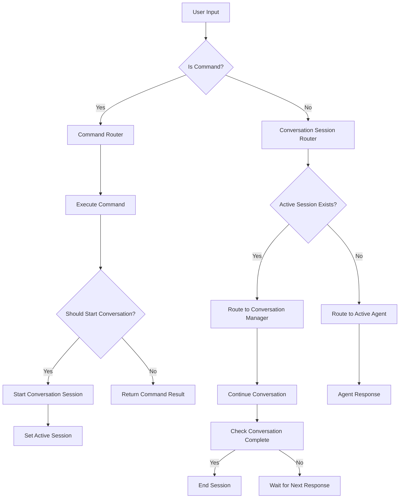

# Design Document

## Overview

This design addresses the critical conversation flow issues in the Docu extension where conversations started by commands like `/new` fail to continue properly. The core problem is that the main chat handler doesn't check for active conversation sessions when routing non-command messages. This design establishes a conversation session routing system that ensures seamless conversation continuity and improves the overall user experience.

## Architecture

### Current Problem Analysis

The current system has several architectural gaps:

1. **Missing Conversation Session Routing**: The `handleChatRequest` function routes non-command messages directly to agents without checking for active conversation sessions
2. **Broken Conversation Continuity**: After commands start conversations, user responses are not routed to the conversation manager
3. **Inconsistent State Management**: No centralized tracking of active conversation sessions
4. **Poor User Guidance**: Tips and examples don't reflect the actual conversation flow capabilities

### Proposed Solution Architecture



## Components and Interfaces

### 1. ConversationSessionRouter

A new component to route non-command messages to the appropriate handler:

```typescript
interface ConversationSessionRouter {
    /**
     * Route user input to conversation or agent
     */
    routeUserInput(
        input: string,
        context: CommandContext
    ): Promise<ConversationRoutingResult>;

    /**
     * Check if there's an active conversation session
     */
    hasActiveSession(): boolean;

    /**
     * Get the active conversation session
     */
    getActiveSession(): ConversationSession | null;

    /**
     * Set the active conversation session
     */
    setActiveSession(sessionId: string): void;

    /**
     * Clear the active conversation session
     */
    clearActiveSession(): void;
}
```

### 2. Enhanced ConversationManager Integration

Extend the conversation manager to work with the session router:

```typescript
interface EnhancedConversationManager extends ConversationManager {
    /**
     * Get active session ID for routing
     */
    getActiveSessionId(): string | null;

    /**
     * Check if a session is active and ready for input
     */
    isSessionActive(sessionId: string): boolean;

    /**
     * Handle user input for active session
     */
    handleUserInput(
        sessionId: string,
        input: string,
        context: CommandContext
    ): Promise<ConversationResponse>;
}
```

### 3. ConversationRoutingResult

Define the result of conversation routing:

```typescript
interface ConversationRoutingResult {
    routedTo: 'conversation' | 'agent' | 'error';
    sessionId?: string;
    agentName?: string;
    response?: string;
    error?: string;
    shouldContinue?: boolean;
}
```

### 4. Enhanced Command Tips System

Improve the tip system to provide better examples:

```typescript
interface CommandTipProvider {
    /**
     * Get tips for a specific command
     */
    getTipsForCommand(
        commandName: string,
        templateId?: string,
        flags?: Record<string, any>
    ): CommandTip[];

    /**
     * Get conversation-related tips
     */
    getConversationTips(
        documentPath?: string,
        agentName?: string
    ): ConversationTip[];
}

interface CommandTip {
    type: 'example' | 'suggestion' | 'warning';
    title: string;
    content: string;
    examples?: string[];
}
```

## Data Models

### ConversationSessionState

Track active conversation sessions:

```typescript
interface ConversationSessionState {
    activeSessionId: string | null;
    sessionsByAgent: Map<string, string>;
    sessionMetadata: Map<string, SessionMetadata>;
}

interface SessionMetadata {
    agentName: string;
    documentPath?: string;
    templateId?: string;
    startedAt: Date;
    lastActivity: Date;
    questionCount: number;
    responseCount: number;
}
```

### Enhanced CommandResult

Extend command results to include conversation session information:

```typescript
interface EnhancedCommandResult extends CommandResult {
    conversationSessionId?: string;
    conversationActive?: boolean;
    nextExpectedInput?: 'conversation' | 'command' | 'any';
}
```

## Error Handling

### Conversation Session Errors

1. **Session Not Found**: When routing to a session that no longer exists
2. **Session Inactive**: When trying to continue an inactive session
3. **Multiple Active Sessions**: When session state becomes inconsistent
4. **Conversation Manager Unavailable**: When the conversation manager fails

### Recovery Mechanisms

```typescript
interface ConversationErrorRecovery {
    /**
     * Handle session not found errors
     */
    handleSessionNotFound(
        expectedSessionId: string,
        context: CommandContext
    ): Promise<void>;

    /**
     * Handle inactive session errors
     */
    handleInactiveSession(
        sessionId: string,
        context: CommandContext
    ): Promise<void>;

    /**
     * Provide fallback when conversation fails
     */
    provideFallback(
        error: ConversationError,
        context: CommandContext
    ): Promise<void>;
}
```

## Testing Strategy

### Unit Tests

1. **ConversationSessionRouter Tests**
   - Test routing logic for different input types
   - Test session state management
   - Test error handling scenarios

2. **Enhanced ConversationManager Tests**
   - Test session tracking and routing
   - Test user input handling
   - Test session lifecycle management

3. **Command Integration Tests**
   - Test conversation session creation from commands
   - Test session routing after command completion
   - Test tip generation and display

### Integration Tests

1. **End-to-End Conversation Flow Tests**
   - Test complete `/new` → conversation → completion flow
   - Test conversation interruption and resumption
   - Test multiple concurrent conversations

2. **Error Recovery Tests**
   - Test session recovery scenarios
   - Test offline mode conversation handling
   - Test conversation manager failures

### Performance Tests

1. **Session Routing Performance**
   - Measure routing decision time
   - Test memory usage with multiple sessions
   - Test session cleanup efficiency

## Implementation Plan

### Phase 1: Core Session Routing

1. Create ConversationSessionRouter component
2. Enhance ConversationManager with session tracking
3. Update handleChatRequest to use session routing
4. Implement basic session state management

### Phase 2: Command Integration

1. Update command handlers to set active sessions
2. Enhance CommandResult with session information
3. Update ConversationFlowHandler to work with session router
4. Test conversation continuity after commands

### Phase 3: Enhanced Tips and Guidance

1. Create CommandTipProvider system
2. Update command handlers to show better tips
3. Add conversation-specific guidance
4. Update tutorial and help documentation

### Phase 4: Error Handling and Recovery

1. Implement ConversationErrorRecovery
2. Add comprehensive error handling to session router
3. Test and validate recovery scenarios
4. Add logging and telemetry for debugging

## Migration Strategy

### Backward Compatibility

- Maintain existing conversation APIs during transition
- Ensure existing agent routing continues to work
- Provide graceful fallback when session routing fails

### Gradual Rollout

1. Implement session router alongside existing system
2. Route conversation sessions through new system
3. Migrate command handlers to use session information
4. Remove old conversation routing patterns

### Risk Mitigation

- Feature flags for new session routing system
- Comprehensive logging for debugging routing decisions
- Fallback to agent routing when session routing fails
- User feedback collection during migration

## User Experience Improvements

### Better Command Tips

Examples of improved tips:

```markdown
💡 **Tip:** Start a conversation while creating your document:
- `/new "My PRD" --with-conversation` - Create document and start PRD conversation
- `/new "API Design" --template basic` then `/chat Tell me about your API requirements`

💡 **Next Steps:**
- Continue the conversation by responding to the questions above
- Use `/chat <message>` to ask specific questions
- Use `/agent current` to see which agent is helping you
```

### Enhanced Conversation Feedback

```markdown
🚀 **PRD Creator Conversation Started**

I'll help you develop your PRD document. Let's start with some questions to gather context.

**Question 1:** What problem does your product solve?

💡 **Examples:**
• Users struggle to manage their tasks efficiently
• Current solutions are too complex for small teams
• There's no good mobile app for this workflow

💬 **Please respond to this question in your next message.**

🤖 **Active Agent:** PRD Creator - Ready for your response!
```

## Success Metrics

### Conversation Continuity

- Percentage of conversations that continue after command execution
- Average number of conversation turns per session
- User satisfaction with conversation flow

### Error Reduction

- Reduction in conversation-related errors
- Improved error recovery success rate
- Decreased support requests about conversation issues

### User Engagement

- Increased usage of conversation features
- Higher completion rate for document creation workflows
- Improved user retention and feature adoption